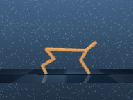
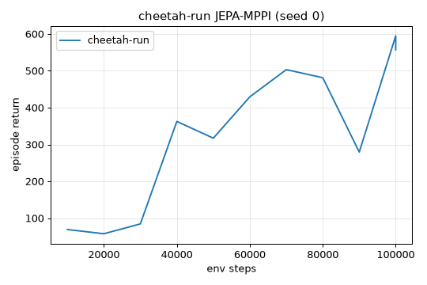
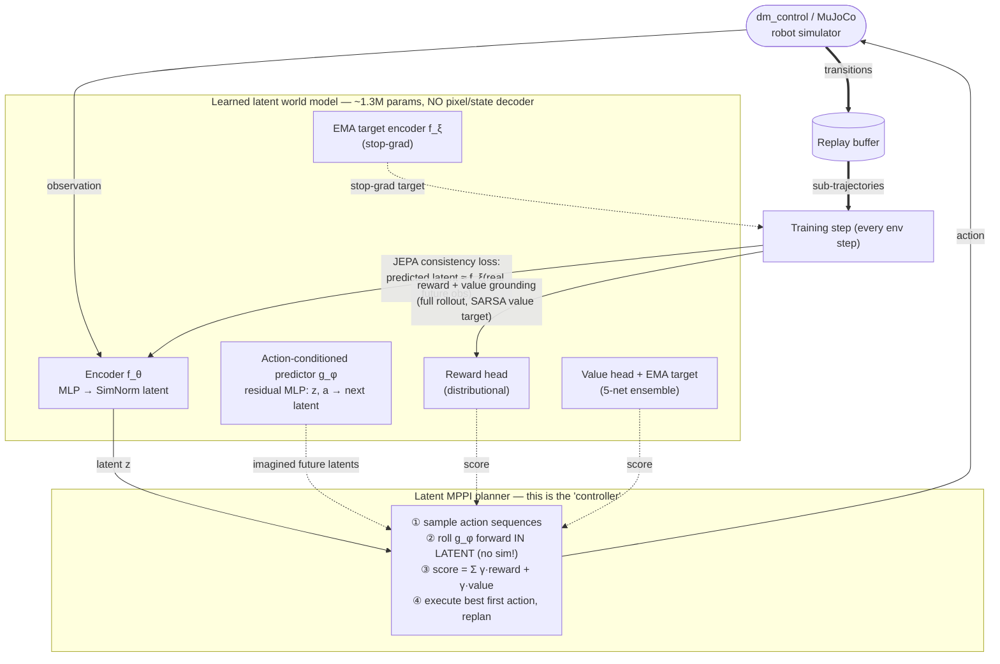

# jepa-ctrl

**Can a small "JEPA" world model, running on a laptop, learn to control a robot by *imagining* the future in its own latent space — with no video, no images, no pixel prediction?**

This repo answers **yes**. A ~1.3M-parameter model, trained for ~20 minutes on a single laptop
GPU, learns to run a simulated cheetah by planning inside a learned latent space.

<p align="center">
  <br/>
  <em>Cheetah running. No animation, no scripting — every action is chosen at runtime by
  planning ~3 steps ahead inside the model's learned latent world. Trained from scratch in ~20 min
  on an RTX 5080 laptop.</em>
</p>

---

## What is this, in plain language?

Most "world models" for robots learn by **predicting the next image** (pixels). That's expensive
and wasteful — you don't need to repaint every blade of grass to decide how to move a leg.

A **JEPA** (Joint-Embedding Predictive Architecture, the idea behind Meta's V-JEPA 2) instead
predicts the *next compressed idea* of the world — an abstract latent — and throws the pixels
away. Meta showed a giant version of this (**V-JEPA 2-AC**) can control real robot arms.

**This project asks: does the same idea work at *laptop scale*?** Build the smallest faithful
version — a tiny latent world model + planning in latent space — and see if it can actually
control a simulated robot. It can.

## Does it work?

| Task (DeepMind Control) | Random policy | **jepa-ctrl (ours)**, 100k steps | "Solved" |
|---|---|---|---|
| **cheetah-run** | ~7 | **522 ± 139** (cross-seed, 3 seeds) ✅ | ~850 |
| reacher-easy | ~40 | **949** (peak, single seed)\* | ~960 |
| walker-walk | ~45 | **419** (peak, single seed)\* | ~960 |

`*` reacher/walker reach near-solved performance but training is not yet stable across the full
run (a late-training value blow-up we're actively fixing — see roadmap). cheetah-run is the
validated, cross-seed result.

<p align="center"><br/>
<em>cheetah-run: episode return vs. environment steps (seed 0). 7 → 557 in 100k steps / ~20 min.</em></p>

## How it works — system block diagram

Three pieces: an **encoder** that turns observations into a latent, an **action-conditioned
predictor** that rolls that latent forward under hypothetical actions (the "world model"), and a
**planner (MPPI)** that imagines many action sequences in latent space and picks the best one.
Crucially there is **no decoder** — the model never reconstructs the observation.



**The two loops:**
- **Control (solid arrows):** observe → encode to latent → MPPI imagines action sequences purely
  in latent space (fast, no simulator) → execute the best first action → repeat.
- **Learning (double/▱ arrows):** store real transitions → train the world model so its
  *predicted* latents match the EMA target encoder's latents of the *real* future (the JEPA bet),
  while reward/value heads keep the latent grounded in the task.

## The key finding (the core scientific bet, answered)

The central question was whether the pure JEPA objective (predict your own future latent) is
*enough*. **It is not** — on its own the latent **collapses**: the encoder learns to ignore the
observation and the predicted-latent loss goes to ~0 trivially while the robot does nothing. The
fix that unlocked control (cheetah 138 → 557, a **4×** jump) was **grounding the latent in the
task**: predict reward at *every* step of the imagined rollout, and bootstrap the value with the
*real* next action. This mirrors why TD-MPC2 works, and it's the load-bearing lesson here.

## Run it

```bash
# 1. install (Blackwell GPUs need the cu128 PyTorch build)
python -m venv .venv && source .venv/bin/activate
pip install torch --index-url https://download.pytorch.org/whl/cu128
pip install -r requirements.txt

# 2. watch the random baseline in the real simulator (renders an mp4 + contact sheet)
PYTHONPATH=. MUJOCO_GL=egl python -m jepa_ctrl.cli --task cheetah-run --controller random --seeds 0,1,2

# 3. train the JEPA-MPPI controller (~20 min on an RTX 5080) and render the result
PYTHONPATH=. MUJOCO_GL=egl python scripts/train.py --task cheetah-run --steps 100000 --seed 0 --outdir runs/cheetah

# 4. tests
PYTHONPATH=. MUJOCO_GL=egl python -m pytest -q
```

## Project layout

```
jepa_ctrl/
  envs.py            dm_control wrapper (flat obs, action-repeat, offscreen render)
  controllers.py     Controller interface + random/zero baselines
  metrics.py         cross-seed returns, collapse diagnostics, latent-fidelity, ACCEPTANCE gates
  render.py          mp4 + annotated keyframe "contact sheet" for eyes-on verification
  evaluate.py        cross-seed evaluation loop
  model/             SimNorm encoder + EMA target, predictor, reward/value heads, latent MPPI, trainer
scripts/train.py     training driver (real-sim eval, collapse trajectory, wall-clock, render)
progress.md          full results table, the frontier roadmap, and what did/didn't work
```

## Roadmap (floor → frontier)

- [x] **RUNG 0 — control a robot from latent planning.** cheetah-run, 522 ± 139 cross-seed. ✅
- [ ] **Stability** — fix the late-training value blow-up so reacher/walker hold near-solved.
- [ ] **RUNG 1** — match TD-MPC2 sample-efficiency across the DMC suite (head-to-head).
- [ ] **RUNG 2** — control from **pixels** (swap the MLP encoder for a small CNN, keep everything else).
- [ ] **RUNG 3** — goal-image / reward-free control (the literal V-JEPA 2-AC mode).
- [ ] **RUNG 4** — manipulation tasks; then a **frozen pretrained V-JEPA encoder**.
- [ ] **RUNG 5** — sim-to-real onto a real SO-101 arm / Unitree Go2.

## How this was built

This is an autonomous research loop: each round forms a hypothesis, implements it test-first,
**verifies in the real simulator** (cross-seed, with the rendered rollout inspected by eye — never
"the loss went down"), and records honest results including negative ones. Acceptance is real
control, not a passing metric. The full round-by-round log lives in [`progress.md`](progress.md).

Hardware: laptop **RTX 5080** (16 GB, Blackwell), 64 GB RAM, PyTorch cu128. Every training run
fits in well under 2 hours.

## Background / credits

Builds on the ideas in **I-JEPA** & **V-JEPA 2 / V-JEPA 2-AC** (Meta AI, joint-embedding
prediction + action-conditioned latent planning), **TD-MPC2** (Hansen et al. — latent MPC with
learned reward/value, our primary baseline), and **DreamerV3** (Hafner et al. — latent world
models). The contribution here is a minimal, laptop-scale, from-scratch instantiation and an
honest study of what makes latent-only control actually work.
